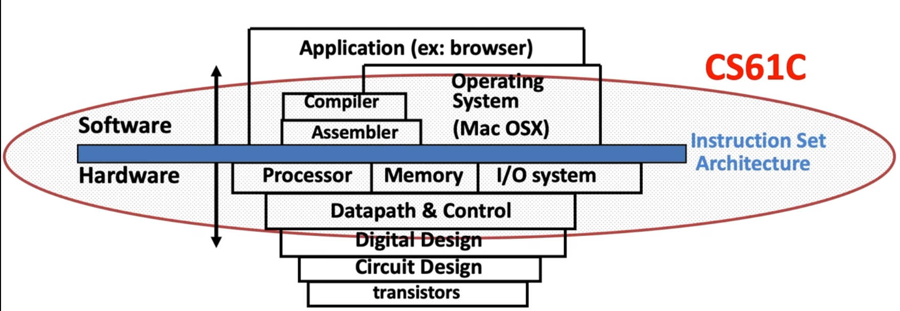
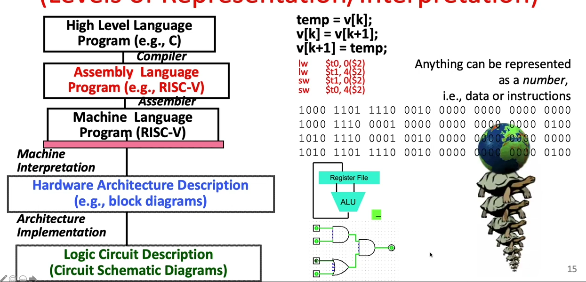
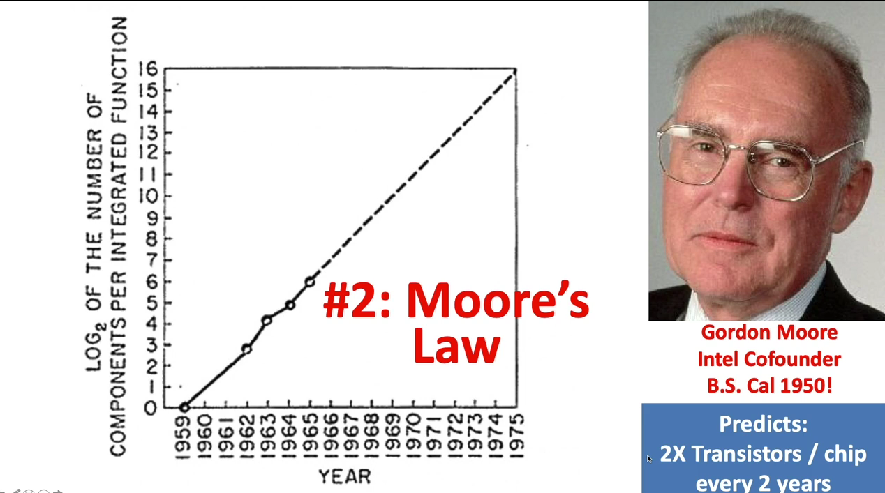
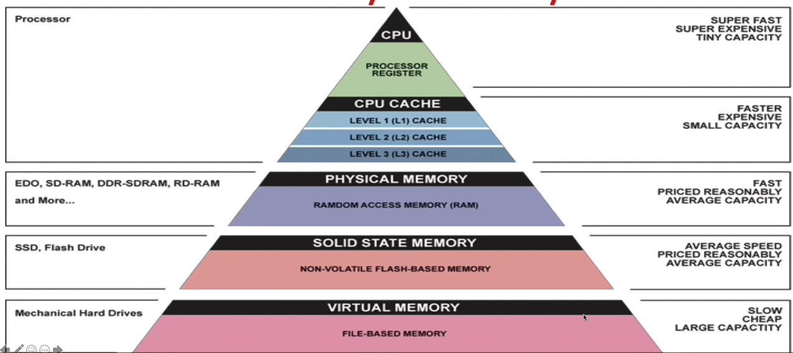
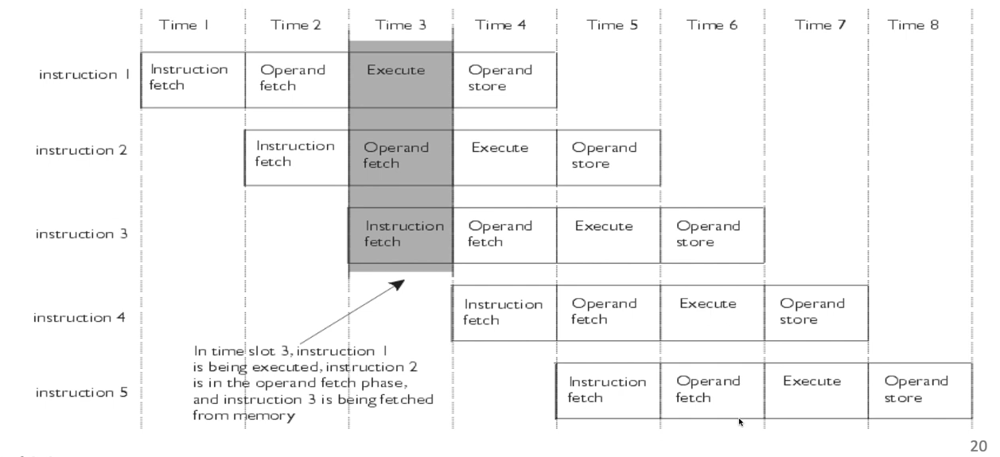
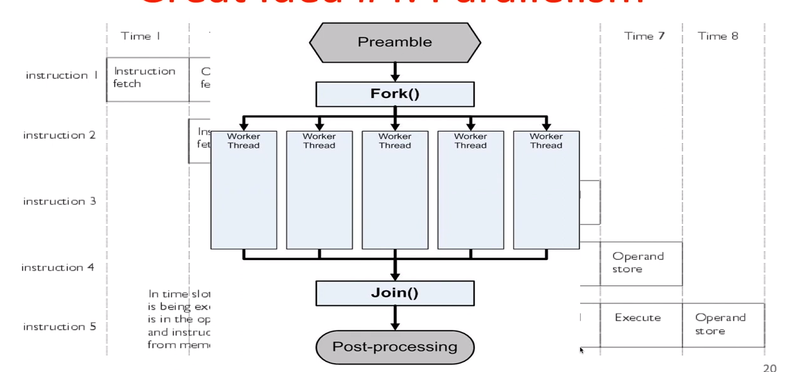
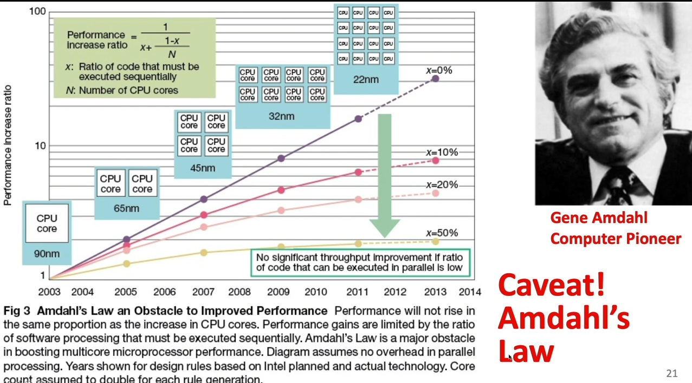
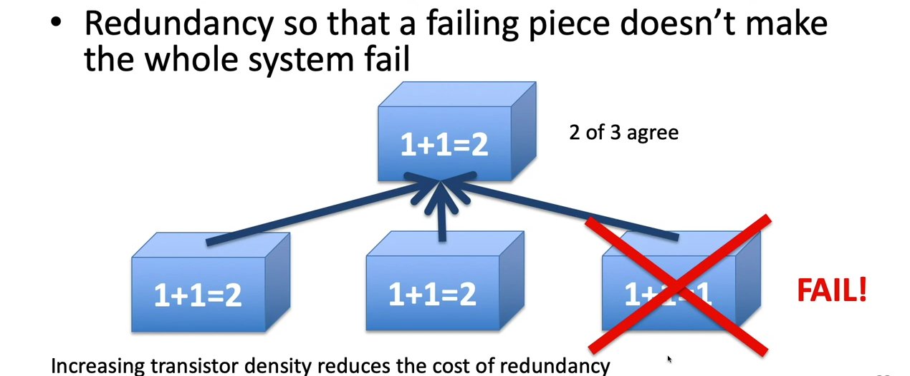
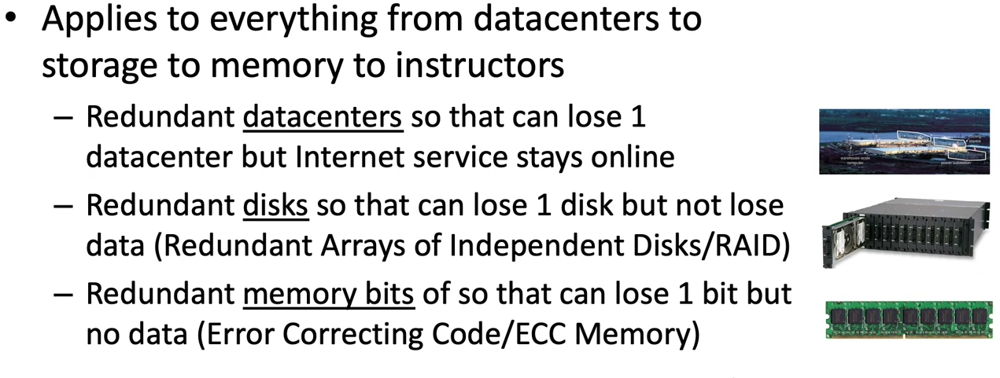
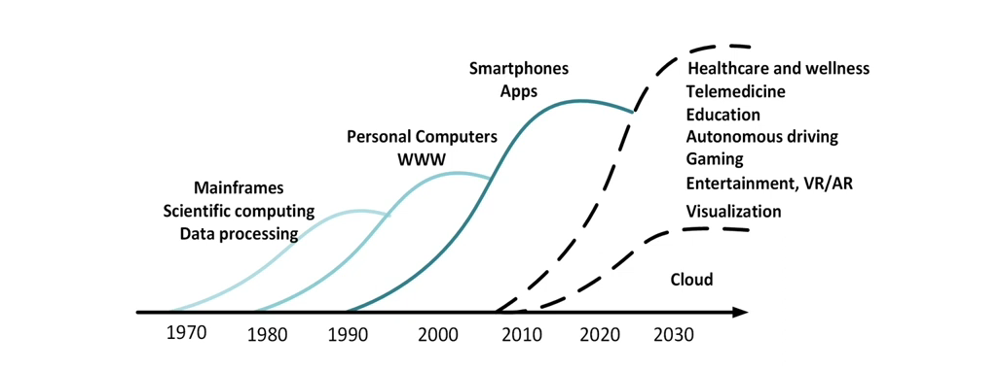

## **What is 61C all about ?**
Its learning about the system that makes software execution possible.

## Idea #1 Abstraction
All the development we see around us has been made possible by reusing all the previous work done by someone else.
Somebody discovered the transistors, which was used by another team to build logic gates, whcih was used by yet another team to design CPU. Then the chip designers provided its ISA, which was used to develope assembly language. Yet another team developed a compiler to ease the life of programers. 

## Idea #2 Moore's Law
The process for transistor packing became more and more efficient, leading to more number of transistors in an unit space. This automatically improved the CPU peformance.

## Idea #3 Principle of locality / Memory Heirarchies
The closer the data resides to the CPU, better its performance would be.
Data on CPU registers is closest and hence instantaneously accessible.
Data on chip cache comes next.
After that comes the on board RAM.
Then comes the connected storage peripherals (Flash, SSD.)
Finally comes the disks or tape based memory storage devices.

Interesting thing to note in above diagram is, each below layer contains a copy of the data available at upper layer.
Also each below layer is one order of magnitude cheaper, bigger but also slower.

## Idea #4 Parallellism
Game of latency and throughput

Increase througput via doing more in same time chunk. This is also known as instruction level parallellism.

Another technique is fork-join (Divide and conquer). This is also known as data level parallellism wherien you process data parallelly in chunks and then join the individual results to get the overall result.

Latency can be improved via having a lesser step count pipeline or higher execution speed.

There is an upper limit to increase in performance achieved by emplying multiple parallel agents.
This upper limit is descirved by Amdahl's law.

## Idea #5 Performance measurement and Improvement
If the performance can be quantified, then only we can have discussions around improving it.
The task execution time is a great metric and it has really helped the processors evolve over time.
All this was possible because, with every little change made in processor design, we could measure the change in its performance.

## Idea #6 Achieving reliability via redundancy
If something is really critical, it must be made reliable and having multiple backup can surely enhance reliability.

## Evolution of Computer Architecture
More and more number of chips being shipped every year and the application domain is also diversifying.

