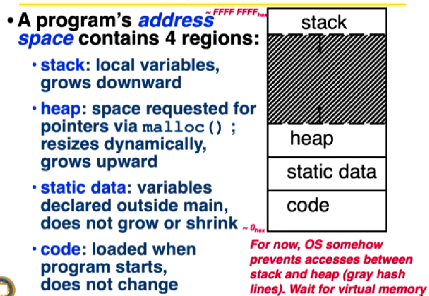

## Program address space
A C program has 4 regions in memory:
1. **Stack** : For storing function's stack frame, local variables, grows downwards. 
The stack is contiguous blocks of memory.
All functions get an allocation on stack during their execution, also called stack frame. 
The local variables used inside the function reside on this stack frame. As soon as the control exits the function body, the stack frame is tossed off the stack to free up memory and all the associated local variables come to an end.  
If the stack grows too big ( some complicated recursive call; call by value for large arguments), bigger than the program's stack space, an overflow error {Stack Overflow} occurs and there is no way to gracefully handle this. The program just crashes. 
Stack pointer is a CPU register that helps in managing the stack section of the program memory. Whenever a new request is pushed on the stack (function call or ISR), the stack pointer is incremented to point to the new top. Conversely, when a request is popped off the stack, the stack pointer is decremented to point to the updated top.

2. **Heap** : Heap of memory available for dynamic requests, Allocated using malloc/calloc and deallocated using free()
Heap is fragmented in nature and generally maintained via a circular doubly linked list. Each block of memory is marked either available or unavailable.
If the program's heap area doesn't have enough memory to accommodate new malloc() requests, malloc would return NULL in that case and hence it can be gracefully handled. Always perform a NULL check after malloc().
Managing heap is complicated because of fragmentation. Although there might a good amount of memory available but it might be fragmented and hence malloc can still return NULL.
3. **Static Data** : Anything declared in global scope, resides in the "Static data" section of the program and lives through out the life of the program.
Some compilers divide this area in further subsections like .bss { uninitialized global members}, .rodata {read only data like string literals or constants}, .rwdata {read-write data}.
4. **Text (Code)** : The code instructions ; loaded when program starts, doesn't change

