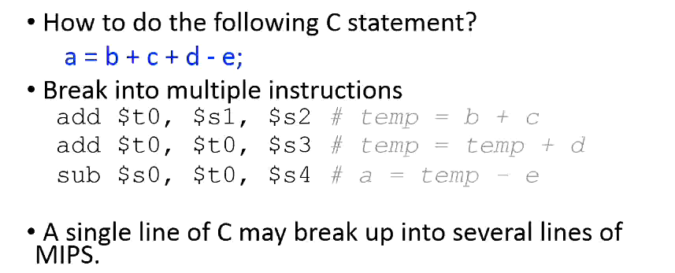
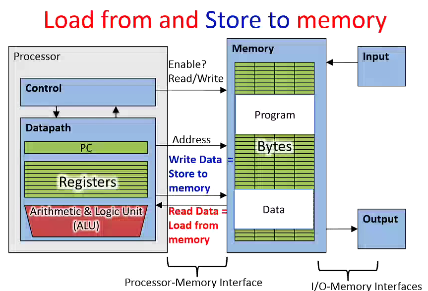
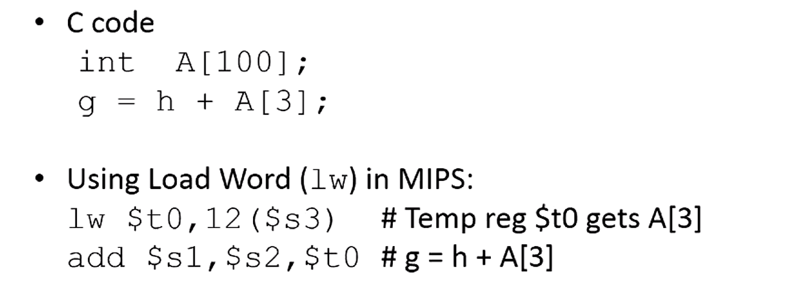
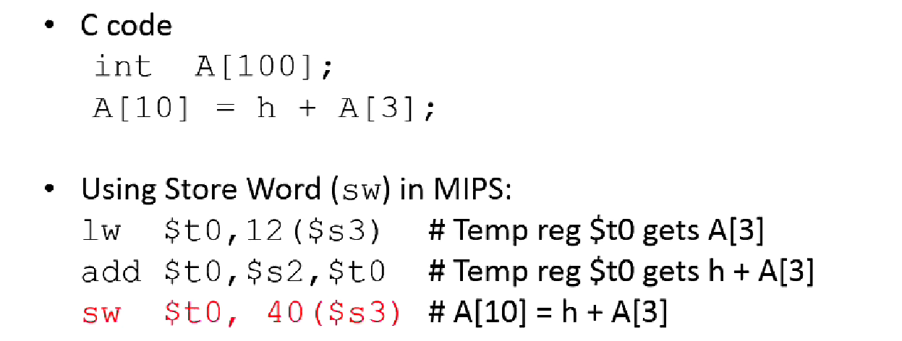

ISA -> Instruction Set Architecture

Each CPU designer provides its ISA which is basically the programming interface for that particular piece of hardware.

## ISA 
RISC -> Reduced Instruction Set Computer
RISC was designed on the philosophy of keeping the instruction set small and simple, which makes it easier to build hardware quickly. Let software do the hardwork by utilizing these simple instruction sets.

MIPS architecture follows RISC.
MIPS supports 32 registers in CPU core. The access to the data on these registers is quite fast.
Why not have many more registers on CPU ? {GoldiLock's problem}
If we have too many registers in CPU, they will loose the quick access feature { Too many register will increase memory space and hence access time will be affected.}

These registers store the operands for any instruction during execution.
The registers are named R0, R1, R2, ..., R31
Registers don't have a type, as variables have in C. The operation determines how the contents of registers will be treated.
Few examples of translation among C and Assembly:

## Data transfer: From memory to Registers
Load Instruction -> Loads data from memory (RAM) to the CPU register
Store Instruction -> Stores data from CPU Register to RAM

Some CPUs provide instruction cache and data cache separately.
The code memory segment is cached into the Instruction cache.
The data memory segment is cached into the data cache.

Another one:

In above case, $s3 stores the base address of array.
Then we offset $s3 by 12 to reach A[3].

Another one:
